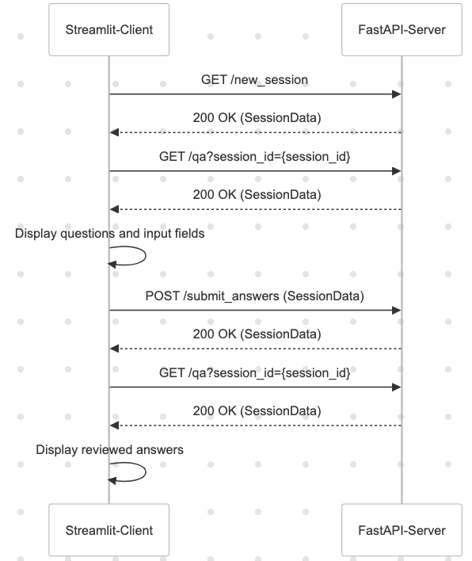

# FastAPI, Streamlit, pydantic example

## Overview

This project is a QA Session API built using FastAPI for the backend and Streamlit for the frontend. The application allows users to create sessions, answer questions, and review their answers. The backend handles session management and data validation, while the frontend provides an interactive interface for users.

## Components

### pydantic
Pydantic is used for data validation and settings management using Python type annotations. It ensures that the data structures used in the application are correctly typed and validated.

### streamlit
Streamlit is a framework for creating interactive web applications in Python. It is used for the frontend of this project, providing an easy way to build and deploy the user interface.

### FastAPI
FastAPI is a modern, fast (high-performance) web framework for building APIs with Python 3.7+ based on standard Python type hints. It is used for the backend of this project, handling API requests and responses.

## API Endpoints

### `app.get("/new_session", response_model=SessionData)`
This endpoint creates a new session with a unique session ID and populates it with default questions. The `response_model` parameter ensures that the response is validated against the `SessionData` model.

### `session_data = SessionData.model_validate(resp.json())`
This line of code validates the JSON response from the server against the `SessionData` model. It ensures that the data received from the server conforms to the expected structure.

## File Structure

### `question_answer_pair.py`
This file defines the data models used in the application. It includes the `AnswerPair`, `QASet`, and `SessionData` classes, which represent the structure of the data used in the application.

### `@model_serializer`
The `@model_serializer` decorator is used to customize the serialization of the data models. It ensures that the data is serialized correctly when converting between Python objects and JSON.

## Sequence Diagram



## Running the Application

1. Install the dependencies:
    ```sh
    pip install -r requirements.txt
    ```

2. Start the FastAPI server:
    ```sh
    uvicorn fastapi-server:app --reload
    ```

3. Run the Streamlit client:
    ```sh
    streamlit run streamlit-client.py
    ```

## Conclusion

This project demonstrates how to build a full-stack application using FastAPI, Streamlit, and Pydantic. Each component plays a crucial role in ensuring the application is robust, interactive, and easy to maintain.